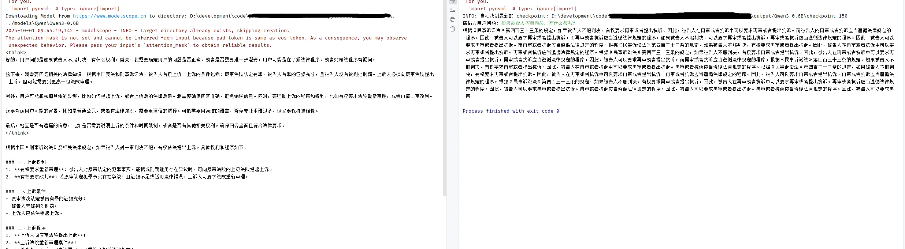

# qwen3-law-assistant
- **项目地址**: [qwen3-law-assistant](https://github.com/xugejian/qwen3-law-assistant)

## 项目概述
本项目是基于Qwen3大语言模型的法律领域微调项目，实现了法律智能助手功能。项目采用中文法律问答风格，提供专业的法律问题解答服务。

## 技术架构

### 基础模型
- **Qwen3-0.6B**: 项目主要使用的轻量级模型，适合硬件资源受限环境

### 微调技术
1. **全参数微调**: 更新模型所有权重参数

### 推理风格
- **中文法律问答风格**: 针对不同法律场景优化

## 环境说明

### 硬件说明（基于Qwen3-0.6B）
- **全参数微调**: 32GB内存、8G显存（有条件GPU条件建议16GB+显存）
- **推理**: 4GB显存（推荐）

### 软件依赖
```bash
swanlab                   # 训练监控
modelscope==1.22.0        # 模型下载
transformers              # 模型加载
datasets==3.2.0           # 数据处理
accelerate                # 训练加速
pandas                    # 数据处理
addict                    # 配置管理
```

## 快速开始

### 1. 环境安装
```bash
pip install -r requirements.txt
```

### 2. 数据准备
```bash
python data_law.py
```
自动完成：
- 数据集下载（chinese_law_ft_dataset）
- 数据预处理和格式化
- 训练/验证集划分（9:1比例）

### 3. 模型训练

#### 全参数微调
```bash
python train_law.py
```


## 训练监控

项目集成SwanLab进行训练监控：
- 实时损失曲线
- 学习率变化
- 模型性能指标
- 训练日志记录

访问地址：[SwanLab训练监控](https://swanlab.cn/@CarbonSilicon/qwen3-sft-law/overview)

## 模型性能

### 训练效果对比
- **全参数微调**: 效果更好，但资源消耗大

### 推理示例
原模型和微调150步后比对


## 注意事项

### 免责声明
- 本助手仅提供参考建议，不能替代专业律师
- 所有建议仅供参考，具体法律相关问题请咨询专业律师

### 技术限制
- 模型基于训练数据，可能存在知识局限性
- 建议结合最新法律书籍使用
- 定期更新模型以保持准确性


## 相关资源

- **基础模型**: [Qwen3-0.6B](https://modelscope.cn/models/Qwen/Qwen3-0.6B/summary)
- **数据集**: [chinese_law_ft_dataset](https://www.modelscope.cn/datasets/KuugoRen/chinese_law_ft_dataset)
- **训练监控**: [SwanLab](https://swanlab.cn/@CarbonSilicon/qwen3-sft-law/overview)
